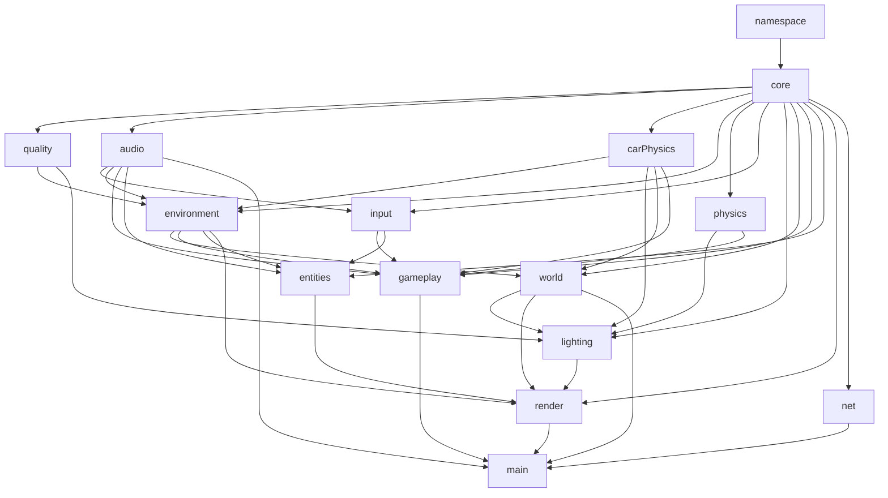

# Game architecture

The browser sees one global object: `window.TownGame`. Each file registers exactly one subsystem on that object, hides its implementation inside a closure, and publishes a frozen API object. After `main.js` loads, the subsystem collection itself is frozen as well.

Mutable launch state lives in `TownGame.core.runtime`: the current screen, active district, keyboard state, pointer state, touch controls, best score, and the two counters that belong to a run rather than to a district — remaining lives and the wallet. `world.buildTown()` creates district-specific state, and the entry point passes it to `gameplay.update()` and `render.draw()`.

`net` sits deliberately at the edge: it depends only on `core`, and nothing in the simulation depends on it. A district never learns whether it is being played alone or shared, which is what keeps the rules in one shape. The one question the loop asks is who owns them — `net.authoritative()` — and when the answer is somebody else, the frame runs `presentFrame` instead of `update`. A district is never sent: both peers grow the same town from one seed and compare `layoutChecksum` before anyone walks around in it.

`physics` also owns the district's static broad phase. Houses, hedges, parked cars, trees, and bushes never move once a town is built, so they are indexed into one uniform grid on first use and rebuilt only when a district replaces its furniture. `solidsNear`, `treesNear`, `softNear`, and `parkedNear` return candidates in list order, which keeps collision resolution identical to walking the full array — the grid narrows the search, it never decides the outcome.

## Change rules

1. A function needed by another subsystem is added to the owner's `Object.freeze({...})` result and explicitly destructured by the consumer.
2. A new subsystem gets its own file and one property on `TownGame`; its script is added to `index.html` after its dependencies.
3. Shared mutable data must not be declared as global variables. It belongs either to `runtime` or to the active district object.
4. After every change, run `tools/verify.ps1` and perform a short browser playthrough.
