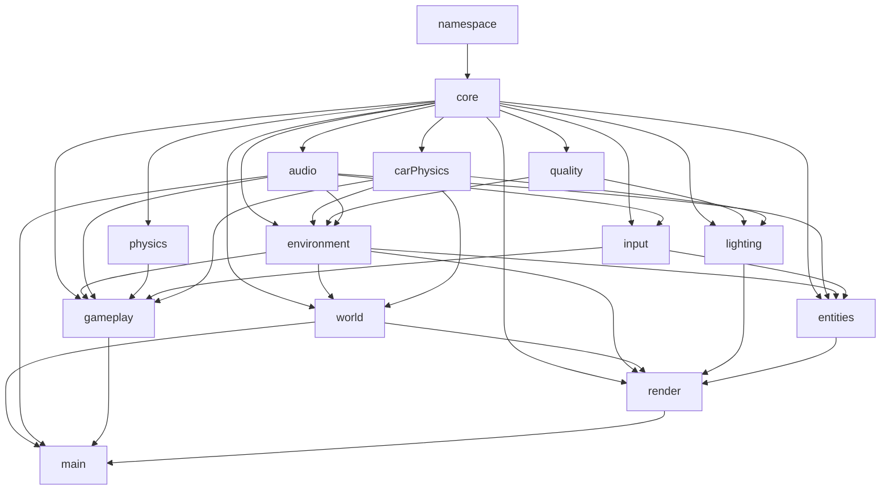

# Архитектура игры

Браузеру доступен один глобальный объект — `window.TownGame`. Каждый файл регистрирует в нём одну подсистему, скрывает реализацию в замыкании и публикует замороженный объект API. После загрузки `main.js` замораживается и сам набор подсистем.

Изменяемое состояние запуска хранится в `TownGame.core.runtime`: текущий экран, активный район, клавиши, указатель, сенсорное управление и рекорд. Состояние конкретного района создаёт `world.buildTown()` и передаёт в `gameplay.update()` и `render.draw()` точка входа.

## Правила изменений

1. Функция, нужная другой подсистеме, добавляется в `Object.freeze({...})` владельца и явно извлекается потребителем.
2. Новая подсистема получает собственный файл и одно свойство в `TownGame`; её файл добавляется в `index.html` после зависимостей.
3. Общие изменяемые данные не объявляются глобальными переменными — они принадлежат `runtime` либо объекту текущего района.
4. После изменения запускается `tools/verify.ps1` и выполняется короткий игровой прогон в браузере.
